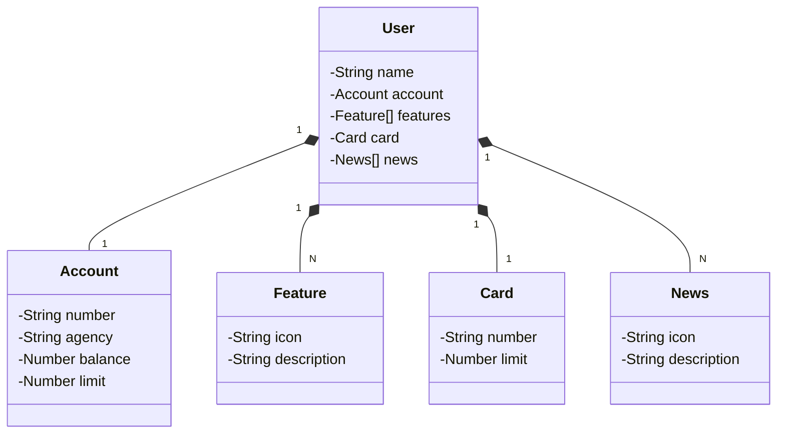

# Santander Dev Week 2023

Java RESTful API criada para a Santander Dev Week.

## Principais Tecnologias
 - **Java 17**: versão LTS mais recente do Java;
 - **Spring Boot 3**: a mais nova versão do Spring Boot;
 - **Spring Data JPA**: ferramenta pode simplificar a camada de acesso aos dados, facilitando a integração com bancos de dados SQL;
 - **OpenAPI (Swagger)**: documentação de API eficaz e fácil de entender usando a OpenAPI (Swagger);
 - **Railway**: facilita o deploy e monitoramento de soluções na nuvem, além de oferecer diversos bancos de dados como serviço e pipelines de CI/CD.

## [Link do Figma](https://www.figma.com/file/0ZsjwjsYlYd3timxqMWlbj/SANTANDER---Projeto-Web%2FMobile?type=design&node-id=1421%3A432&mode=design&t=6dPQuerScEQH0zAn-1)

O Figma foi utilizado para a abstração do domínio desta API, sendo útil na análise e projeto da solução.

## Diagrama de Classes (Domínio da API)

versão mais robusta do projeto:

### [digitalinnovationone/santander-dev-week-2023-api](https://github.com/digitalinnovationone/santander-dev-week-2023-api)

Lá está inclusa todos os endpoints de CRUD, além de aplicação de boas práticas (uso de DTOs e refinamento na documentação da OpenAPI). 
